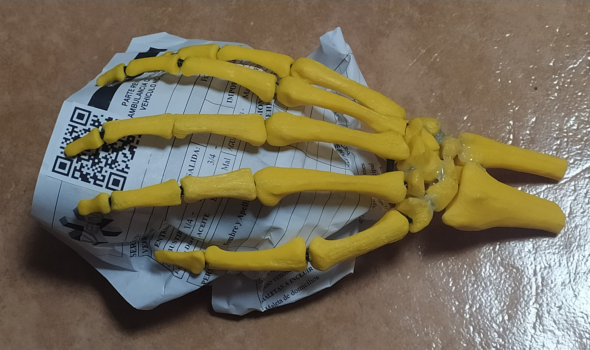

# Proyecto de Aplicación Didáctica de Anatomía de la Mano

## Descripción del Proyecto

Esta aplicación tiene como objetivo proporcionar una herramienta didáctica interactiva para el estudio de los huesos de la mano. Utiliza un modelo 3D de la mano, impreso con impresora 3D, el cual se puede utilizar para visualizar y explorar en detalle, y se complementa con un cuestionario de preguntas sobre la anatomía de la mano. Los usuarios pueden acceder al modelo 3D mediante un código QR que enlaza con la aplicación.

Puedes descargar el modelo de la mano para imprimirlo usando una impresora 3D del siguiente [enlace](https://www.thingiverse.com/thing:4841107).

Y el código Qr de acceso al cuestionario lo puedes encontrar aquí bajo.

También puedes encontrar versiones alternativas del Qr en el repositorio, dentro del directorio de imágenes.

## Características

- **Modelo 3D Interactivo**: Permite a los usuarios explorar los huesos de la mano en detalle.
- **Cuestionario de Preguntas**: Una serie de preguntas interactivas para evaluar y mejorar el conocimiento sobre la anatomía de la mano.
- **Acceso mediante Código QR**: Facilita el acceso al modelo 3D y a la aplicación mediante un simple escaneo del código QR.

## Uso de la Aplicación

1. **Escanea el Código QR**: Utiliza tu dispositivo móvil para escanear el código QR proporcionado. Esto te llevará a la aplicación web.
2. **Explora el Modelo 3D**: Interactúa con el modelo 3D de la mano para familiarizarte con los diferentes huesos.
3. **Responde las Preguntas**: Participa en el cuestionario para poner a prueba tus conocimientos sobre los huesos de la mano.
